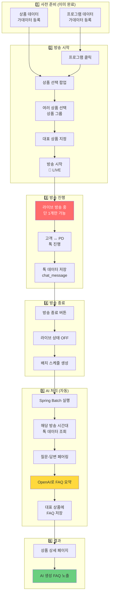
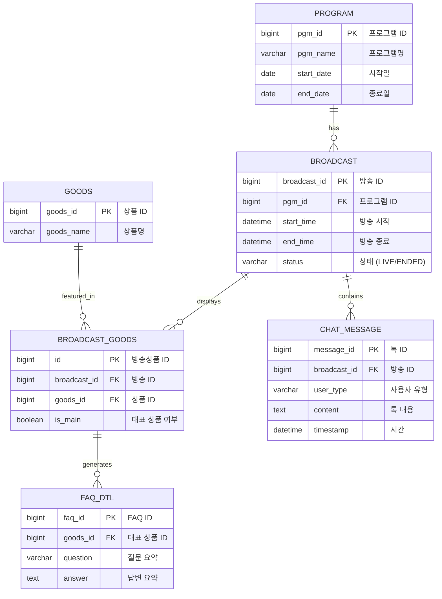
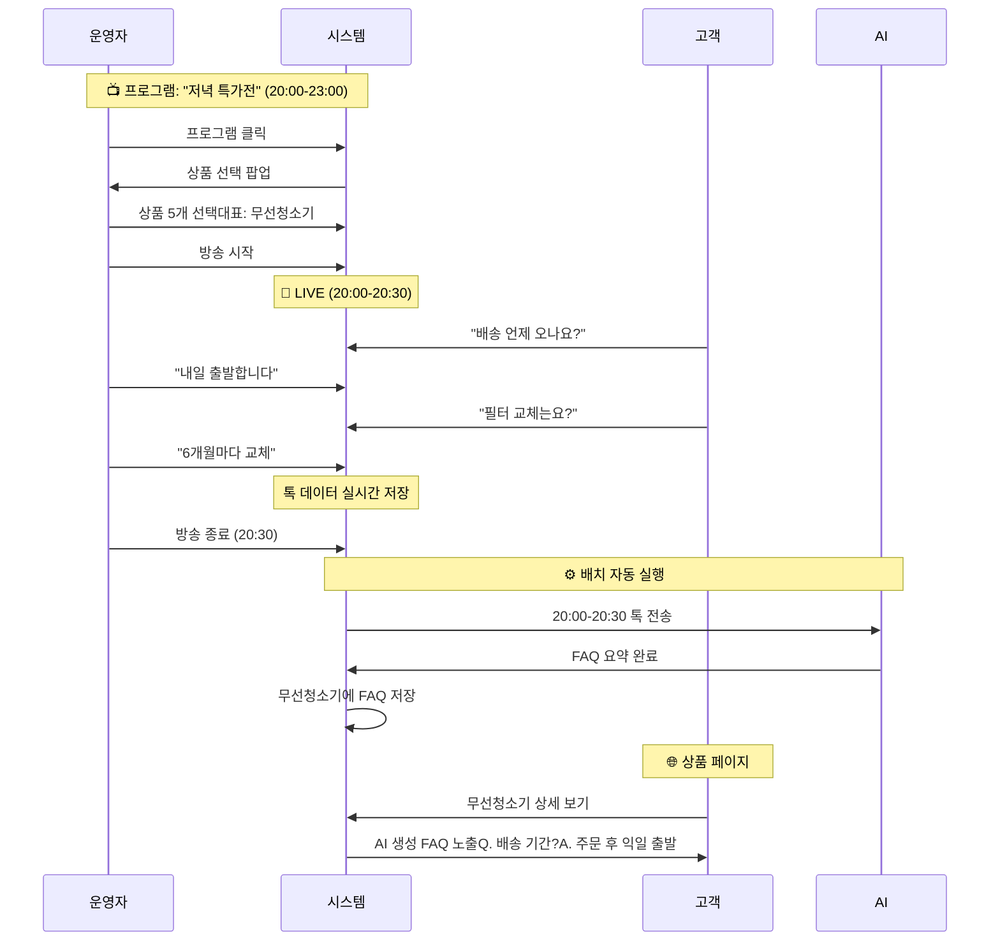
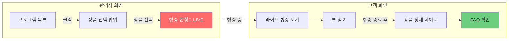

# AI-FAQ
> 라이브 커머스 채팅 데이터를 AI로 분석하여 자동으로 상품 FAQ를 생성하는 시스템


---

## 📋 목차

- [프로젝트 소개](#-프로젝트-소개)
- [주요 기능](#-주요-기능)
- [기술 스택](#%EF%B8%8F-기술-스택)
- [시스템 아키텍처](#-시스템-아키텍처)
  
---

## 🎯 프로젝트 소개

### 배경

라이브 커머스 방송에서는 하루 평균 **3,000개 이상**의 고객 질문이 실시간으로 발생합니다.  
하지만 방송 종료 후 이 귀중한 Q&A 데이터가 활용되지 못하고 사라지는 문제가 있었습니다.

### 기존 문제점

| 문제 | 영향 |
|------|------|
| CS팀이 방송 다시보기를 보며 수동으로 FAQ 작성 | 상품당 2-3시간 소요 |
| 주관적인 선별로 중요한 질문 누락 가능성 | FAQ 품질 편차 발생 |
| 방송 종료 후 2-3일 뒤에야 FAQ 게시 | 고객 이탈 및 문의 증가 |

### 해결 방안

**AI 기반 자동 FAQ 생성 시스템**을 구축하여:
- ✅ 방송 종료 후 **30분 이내** FAQ 자동 생성
- ✅ 모든 질문을 객관적으로 분석하여 **중요도 기반 선별**

### 프로젝트 정보

- **기간**: 2024.11 - 2024.12 (4주)
- **역할**: 백엔드 개발 및 AI 파이프라인 설계
- **팀 구성**: 1인 프로젝트 (실무 경험 기반 재구성)

---

## ✨ 주요 기능

### 1. 🤖 AI 기반 FAQ 자동 생성
- OpenAI GPT-4 API를 활용한 자연어 처리
- 질문-답변 자동 페어링 알고리즘
- 중복 질문 자동 병합 및 요약

### 2. ⚙️ Spring Batch 배치 처리
- 방송별 상품 시간대 기반 데이터 수집
- Chunk 기반 대용량 데이터 처리 (10개 단위)
- 실패 복구 및 재시작 기능
- Skip/Retry 정책을 통한 안정성 확보

## 🛠️ 기술 스택

### Backend
- **Java** 17
- **Spring Boot** 3.2.0
- **Spring Batch** (Spring Boot 3.x)
- **MyBatis** 3.0.3
- **Gradle** 8.x
- **Spring WebFlux** (비동기 처리)
- **Spring AOP** (로깅, 트랜잭션)

### AI/ML
- **OpenAI** GPT-4 API
- **Prompt Engineering**
- **WebClient** (API 통신)

### Frontend
- **Thymeleaf**
- **Vue.js** (선택적)
- **JavaScript**

### Database
- **MySQL** 8.0
- **MyBatis** (Persistence Layer)

---

## 🏗 시스템 아키텍처

### 전체 구조

```
프로그램 (1-3시간)
  └─ 여러 개의 방송 (상품 그룹)
      └─ 여러 개의 상품
          └─ 대표 상품 1개
              └─ AI 생성 FAQ
```

### 운영 규칙
- ✅ 프로그램: 기간을 가지고 있음 (예: 12/1 ~ 12/31)
- ✅ 방송: 한 번에 1개만 노출 가능 (라이브 중)
- ✅ 방송 중 톡 발생 → 방송 종료 → AI FAQ 자동 생성
- ✅ FAQ는 대표 상품에 저장됨

---

## 📊 시스템 흐름도



---

### 데이터베이스 ERD

**핵심 테이블 구조**

## 💡 운영 시나리오 예시



---

## 🎨 화면 흐름



---
